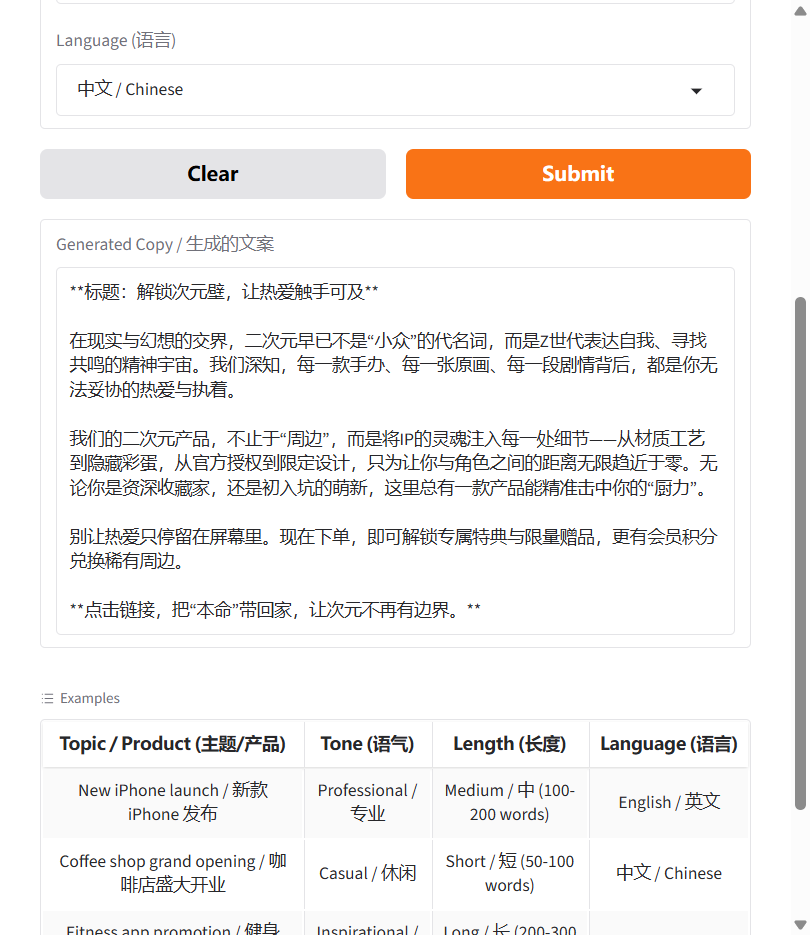

# AI Copywriting Tool (AI 文案生成器)

A web-based AI copywriting tool that generates marketing copy for social media platforms. Built with Streamlit and DeepSeek API, supporting multiple languages (Chinese, English, Cantonese) and customizable tone/length.

基于 Streamlit 和 DeepSeek API 的 AI 文案生成工具，支持多语言（中文、英文、粤语）和可定制的语气/长度。

## Features (功能)

- **Multi-language Support**: Generate copy in Chinese, English, or Cantonese (支持中文、英文、粤语)
- **Customizable Tone**: Professional, Casual, Humorous, Inspirational, or Urgent (5 种语气可选)
- **Flexible Length**: Short (50-100 words), Medium (100-200 words), or Long (200-300 words) (3 种长度可选)
- **One-Click Deployment**: Launch locally or deploy to HuggingFace Spaces (本地运行或部署到 HuggingFace)
- **Example Templates**: Pre-built examples for quick testing (内置示例模板)

## Tech Stack (技术栈)

- **Frontend**: Streamlit (Python UI framework)
- **AI Model**: DeepSeek API (`deepseek-chat`) — OpenAI-compatible, cost-effective
- **Language**: Python 3.12+

## Architecture (架构)

```
┌─────────────┐     ┌──────────────┐     ┌─────────────┐
│  Streamlit  │────▶│  DeepSeek    │────▶│  Generated  │
│     UI      │     │    API       │     │    Copy     │
└─────────────     └──────────────┘     └─────────────┘
       │                    ▲
       │                    │
       ▼                    │
  User Input          API Key (env)
(topic, tone,
 length, lang)
```

## Installation (安装)

1. Clone this repository:
```bash
git clone https://github.com/xi195072-a11y/portfolio-projects.git
cd portfolio-projects/01-ai-copywriting-tool
```

2. Install dependencies:
```bash
pip install -r requirements.txt
```

3. Set your DeepSeek API key:
```bash
# Windows (PowerShell)
$env:DEEPSEEK_API_KEY="your-api-key-here"

# Windows (CMD)
set DEEPSEEK_API_KEY=your-api-key-here

# macOS/Linux
export DEEPSEEK_API_KEY="your-api-key-here"
```

Get your API key at: https://platform.deepseek.com/

## Usage (使用)

Run the application:
```bash
streamlit run streamlit_app.py
```

The app will start at `http://localhost:8501`.
应用启动在 `http://localhost:8501`。

## Deploy to Streamlit Cloud (部署到 Streamlit Cloud)

1. Fork this repository on GitHub
2. Go to https://share.streamlit.io/
3. Click "New app"
4. Select your forked repository
5. Set main file to `streamlit_app.py`
6. Add `DEEPSEEK_API_KEY` as a secret in Streamlit Cloud settings
7. Your app is live!

## Project Structure (项目结构)

```
01-ai-copywriting-tool/
├── streamlit_app.py        # Main Streamlit application (主程序)
├── app.py                  # Original Gradio app (Gradio 版本，保留)
├── requirements.txt        # Python dependencies (依赖)
├── .env.example            # Example env config (环境变量示例)
── .streamlit/
│   └── config.toml         # Streamlit config (Streamlit 配置)
└── README.md               # This file (说明文档)
```

## How It Works (工作原理)

1. User inputs topic, selects tone, length, and language (用户输入主题、选择语气、长度和语言)
2. Streamlit UI sends parameters to `generate_copy()` function (Streamlit 界面将参数发送给函数)
3. Function constructs a prompt for DeepSeek API (函数构建提示词)
4. DeepSeek generates marketing copy based on the prompt (DeepSeek 生成文案)
5. Result is displayed in the UI (结果显示在界面)

## Customization (自定义)

### Add More Tones (添加更多语气)
Edit the `tone_map` in `streamlit_app.py`:
```python
tone_map = {
    "Professional / 专业": "professional",
    "Casual / 休闲": "casual",
    "YOUR_TONE": "your_value",
}
```

### Change AI Model (更换 AI 模型)
Modify the model parameter in `streamlit_app.py`:
```python
response = client.chat.completions.create(
    model="deepseek-chat",  # Or other DeepSeek models
    ...
)
```

### Add More Languages (添加更多语言)
Update the `lang_map` dictionary in `streamlit_app.py`.

## Screenshots (截图)

### Main UI / 主界面


### Generated Output / 生成结果


## Future Enhancements (未来改进)

- [ ] Add image generation for social media posts (添加配图生成)
- [ ] Support more languages (Japanese, Korean, etc.) (支持更多语言)
- [ ] Add copy history and favorites (添加文案历史和收藏)
- [ ] Integrate with social media APIs for direct posting (集成社交媒体 API 直接发布)
- [ ] Add A/B testing for multiple copy variations (添加 A/B 测试)

## Author (作者)

**Zhong Jiaxi (钟嘉禧)**
- GitHub: [@xi195072-a11y](https://github.com/xi195072-a11y)
- Email: 1005270675@qq.com

## License (许可证)

MIT License - feel free to use this project for learning or commercial purposes.
