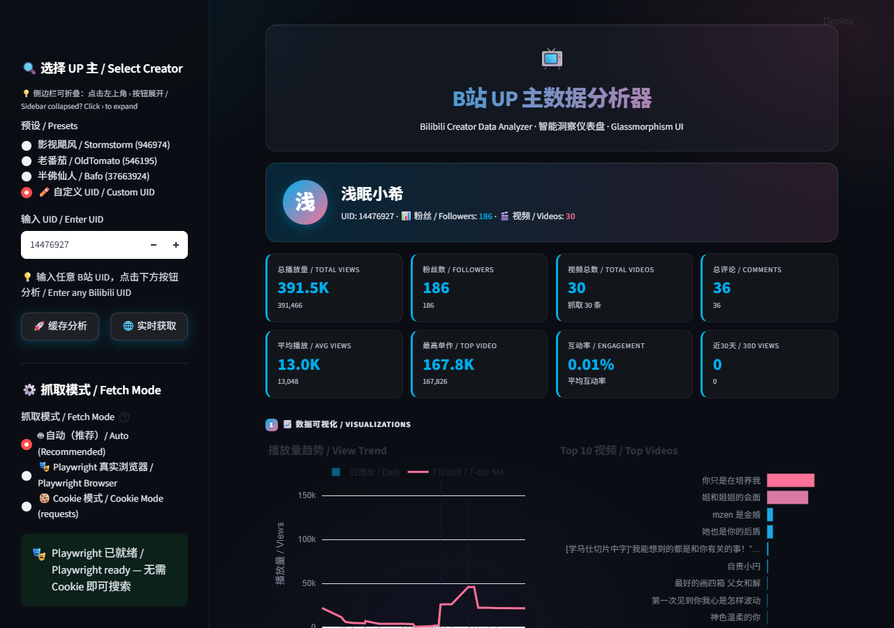

# Portfolio Projects / 作品集

> 3 个实战项目 — AI 文案生成器、社媒数据分析器、自动化工作流引擎。
> Three hands-on projects: AI Copywriting Tool, Social Media Analyzer, Automation Workflow Engine.

---

## 项目一览 / Projects Overview

| # | 项目 | 目录 | 状态 | 技术栈 |
|---|------|------|------|--------|
| 01 | **AI 文案生成器** / AI Copywriting Tool | [`01-ai-copywriting-tool/`](./01-ai-copywriting-tool/) |  ✅ 已上线 | Python · Streamlit · DeepSeek API · Glassmorphism UI |
| 02 | **B站 UP 主数据分析器** / Bilibili Creator Analyzer | [`02-social-media-analyzer/`](./02-social-media-analyzer/) | 🟢 Playwright 模式已上线 | Python · Streamlit · Plotly · Playwright · B站 API · Glassmorphism UI |
| 03 | **自动化工作流引擎** / Automation Workflow Engine | [`03-automation-workflow/`](./03-automation-workflow/) | 🔴 待开发 | Python · DeepSeek API |

---

## 项目详情 / Project Details

### 01 · AI 文案生成器 / AI Copywriting Tool

**Status:** ✅ Production-ready · 毛玻璃 UI · 多语言营销文案生成

一个基于 DeepSeek API 的社媒营销文案生成工具，支持中/英/粤三语，可自定义语气、长度和语言。毛玻璃风格深色仪表板，支持 Token 用量优化、会话缓存和一键复制。

A web-based AI copywriting tool that generates marketing copy for social media, supporting Chinese, English, and Cantonese with customizable tone, length, and language. Glassmorphism dark UI with token optimization, session caching, and one-click copy.

**亮点 / Highlights：**
- 🌏 三语支持（中文 / English / 粵語）
- 🎨 5 种语气（Professional / Casual / Humorous / Inspirational / Urgent）
- 📏 3 种长度（Short / Medium / Long）
- 💰 Token 用量优化，成本可控
- 🛡️ 完善的错误处理（认证错误 / 限流 / 超时）
- 🔒 API Key 本地会话存储，不上传
- 🎨 毛玻璃 Glassmorphism 深色主题

**快速开始 / Quick Start：**
```bash
cd 01-ai-copywriting-tool
pip install -r requirements.txt
$env:DEEPSEEK_API_KEY = "your-key"   # Windows
streamlit run streamlit_app.py
```

**截图 / Screenshots：**


---

### 02 · B站 UP 主数据分析器 / Bilibili Creator Analyzer

**Status:** 🟢 Playwright 免 Cookie 模式已上线 · 实时搜任意 UID · 8 KPI + 5 图表

毛玻璃风格的 B 站 UP 主视频数据分析仪表板。支持两种抓取模式：**Playwright 真实浏览器（免 Cookie）** 和 **Cookie（requests）**。实时 API 获取 + 预取缓存数据双轨保障，提供 8 个 KPI 卡片、5 个交互式 Plotly 图表、智能洞察和 CSV 导出。

A glassmorphism-style Streamlit dashboard for analyzing Bilibili UP main creators' video performance. Features two fetch modes: **Playwright real browser (no Cookie needed)** and **Cookie (requests)**. Dual data source (real-time API + pre-cached), 8 KPI cards, 5 interactive Plotly charts, smart insights, and CSV export.

**亮点 / Highlights：**
- 🎭 **Playwright 免 Cookie 模式**：复用系统 Chrome，headless 直接搜任意 UID，无需登录、无需复制 Cookie
- 📊 8 个 KPI 卡片：总播放量、粉丝数、视频总数、总评论、平均播放、最高单作、互动率、近 30 天播放
- 📈 5 个交互式图表：播放趋势（含 7 日均线）、Top 10 热门、月度发布、互动饼图、发布时间热力图
- 💡 智能洞察：最佳发布时间、头部集中度、互动率水平、更新频率
- 🔄 双轨数据：预取缓存（稳定）+ 实时 API（即时）
- 🛡️ B站反爬绕过：WBI 签名 + dm_img_* 画布指纹 + Playwright 去自动化指纹
- 🌐 中英双语 UI

**快速开始 / Quick Start：**
```bash
cd 02-social-media-analyzer
pip install -r requirements.txt   # 安装 Playwright（推荐，免 Cookie）
python run_app.py                  # 启动
# 浏览器打开 http://localhost:8502
```

**截图 / Screenshots：**



---

## 技术栈 / Tech Stack

- **语言**: Python 3.12+
- **UI 框架**: Streamlit 1.62
- **图表**: Plotly（交互式数据可视化）
- **AI API**: DeepSeek API (`deepseek-chat`)（01 项目）
- **浏览器自动化**: Playwright（02 项目，复用系统 Chrome）
- **数据**: Pandas（数据处理）

---

## 开发文档 / Documentation

| 文件 | 用途 |
|------|------|
| `PROJECT_BRIEF.md` | 技术规范与代码标准（给 AI 和开发者看） |
| `PROJECT_PLAYBOOK.md` | 新项目启动章程（每次开新项目时按这个流程走） |
| `TRAE_INSTRUCTIONS.md` | AI 编程助手快速参考（Trae/Cursor 等工具读取） |

---

## 关于 / About

小希
MSc Chinese Environmental Studies, HKMU (2026-2027) · CS/Big Data 本科。

- GitHub: [@xi195072-a11y](https://github.com/xi195072-a11y)
- 方向: Data Analyst · AI Application Engineer · Tech Operations
